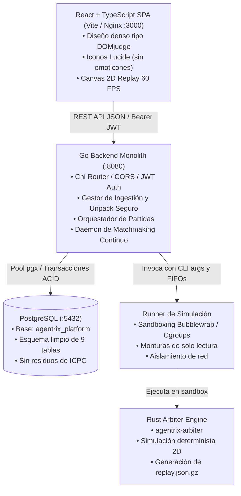

# Agentrix Platform - Developer & Operational Guide

Plataforma integral para concursos y rankings continuos de agentes de Inteligencia Artificial (sin herencia ni conceptos de competición ICPC).

---

## 1. Arquitectura del Sistema



---

## 2. Componentes Implementados

### A. Base de Datos (PostgreSQL)
- **Base de datos:** `agentrix_platform`
- **Tablas limpias (9 tablas relacionales, 82% reducción frente a DOMjudge):**
  1. `users`: Autenticación, roles (`admin`, `player`), contraseñas Bcrypt.
  2. `api_keys`: Tokens de despliegue para bots.
  3. `teams`: Equipos e instituciones participantes.
  4. `arenas`: Parámetros competitivos de las arenas (jugadores, ticks máximos, reglas).
  5. `agent_versions`: Ingestión de bots, hashes SHA-256, runtimes (`python-standard`, `rust-musl`, `binary`).
  6. `ladder_entries`: Clasificación continua Elo ($\mu \pm \sigma$, ratio de victorias, bajas, supervivencia).
  7. `matches`: Partidas programadas y concluidas, duración y logs.
  8. `match_participants`: Asientos, puestos 1º..5º, puntuación y delta de rating $\pm\Delta$.
  9. `replays`: Metadatos de repeticiones comprimidas en `gzip` con checksums.
  10. `audit_logs`: Trazabilidad completa de acciones del sistema.

### B. Backend Monolítico (Go)
- **Localización:** `backend/`
- **Módulos:**
  - `internal/api`: Controladores REST completos (`/auth`, `/arenas`, `/ladder`, `/matches`, `/replays`, `/agents`, `/teams`, `/audit-logs`, `/system`).
  - `internal/runner`: Orquestador que ejecuta el motor en Rust con argumentos CLI, parsea el veredicto, calcula puntuaciones y genera `replay.json.gz`.
  - `internal/ladder`: Algoritmo multi-jugador de Elo conservativo para partidas de 5 bots con factor K dinámico y penalización por descalificación.
  - `internal/matchmaker`: Goroutine en segundo plano que empareja continuamente bots activos en ventanas de rating cercanas.
  - `internal/validation`: Extracción segura contra Zip Slip y Zip Bomb + handshake de protocolo de 3 segundos.

### C. Frontend SPA (React + TypeScript)
- **Localización:** `frontend/`
- **Estilo:** Alta densidad de datos inspirada en DOMjudge, paleta oscura pizarra (`slate-950`), sin emoticones, interfaz corporativa con iconos `lucide-react`.
- **Vistas implementadas:**
  - **Standings (Ladder):** Scoreboard continuo con filtros, medallas para el top 3, barras de winrate y ratings Elo.
  - **Matches:** Historial de partidas con los 5 asientos y puestos, duración, estado y botones de acción rápida.
  - **2D Canvas Replay Player (60 FPS):** Reproductor interactivo con controles de velocidad (0.5x..10x), barra de tiempo, avatares con barras de vida, dirección de disparo, zona de tormenta y killfeed.
  - **Bots & Ingestion:** Panel de subida de paquetes `.zip`, selección de runtime y descalificación administrativa.
  - **Arenas, Teams & Audit Logs:** Paneles informativos de reglas, equipos y trazabilidad.
  - **System Health:** Diagnóstico en tiempo real del estado de PostgreSQL, Rust Arbiter y cola de partidas.

### D. Motor de Simulación (Rust)
- **Binario:** `agentrix/arbiter/target/release/agentrix-arbiter`
- Simula partidas Battle Royale de 5 agentes con límite de tiempo por tick, gestión de bots descalificados y generación de telemetría por tick.

---

## 3. Opciones de Despliegue y Ejecución

### Opción A: Despliegue Local (Desarrollo y Testing Rápido)
```bash
# Iniciar backend y frontend conjuntamente
make agentrix-run-local

# O iniciar con los scripts dedicados:
./scripts/start_backend.sh   # Backend Go en :8080
./scripts/start_frontend.sh  # Frontend Vite en :3000
```
- **Frontend SPA:** http://localhost:3000
- **Backend API:** http://localhost:8080/api/v1
- **Credenciales Admin por Defecto:** `admin` / `admin123`

### Opción B: Despliegue en Contenedores Docker Compose (Producción)
```bash
# Levantar stack completo en contenedores
make agentrix-up

# Detener stack
make agentrix-down
```
- Orquesta contenedor PostgreSQL (`db`), contenedor Go con Bubblewrap (`backend`) y contenedor Nginx (`frontend`).
- Los datos persisten en volúmenes Docker nombrados: `agentrix-pgdata` y `agentrix-data`.

---

## 4. Respaldos y Recuperación ante Desastres

El sistema incluye herramientas automatizadas con verificación criptográfica SHA-256:

### Generar Respaldo
```bash
make agentrix-backup
# O directamente:
./scripts/backup.sh
```
- Genera un volcado transaccional de PostgreSQL en `var/agentrix/backups/agentrix_db_<timestamp>.sql.gz`.
- Empaqueta las repeticiones en `agentrix_replays_<timestamp>.tar.gz` y artefactos de bots.
- Emite un archivo de manifiesto `manifest_<timestamp>.json` con sumas de verificación.

### Restaurar Respaldo
```bash
make agentrix-restore BACKUP=agentrix_db_<timestamp>.sql.gz
# O directamente:
./scripts/restore.sh var/agentrix/backups/agentrix_db_<timestamp>.sql.gz
```
- Cierra conexiones concurrentes, restaura esquema y datos, descomprime repeticiones y valida la integridad.

---

## 5. Herramientas Operativas y Pre-Flight

### Validación del Entorno (Pre-Flight)
```bash
make agentrix-validate
# O:
python3 scripts/validate_arena.py
```
Verifica:
1. Aislamiento por namespaces en el kernel de Linux (`bwrap`).
2. Binario del árbitro Rust y respuesta CLI.
3. Conectividad y tablas relacionales de PostgreSQL.
4. Resistencia criptográfica a Zip Slip y Zip Bomb.
5. Permisos en directorios de almacenamiento.
6. Binario del servidor Go.
7. Artefactos de producción del frontend SPA.

### Aprovisionamiento y Benchmark de Torneos
```bash
make agentrix-provision
# O:
python3 scripts/provision_tournament.py --rounds 3
```
- Autentica con la API, detecta bots en el ladder, programa partidas competitivas de calibración e imprime la tabla final de Elo en consola.

---

## 6. Pruebas de Integración y E2E

Para ejecutar toda la suite de pruebas unitarias y de extremo a extremo:
```bash
make agentrix-test
```
Verifica:
- Pruebas unitarias de Go (conservación de Elo multijugador, penalización por descalificación).
- Suite E2E completa: autenticación, consultas REST, ejecución real en sandbox con el árbitro Rust, streaming de repeticiones y build de producción.
